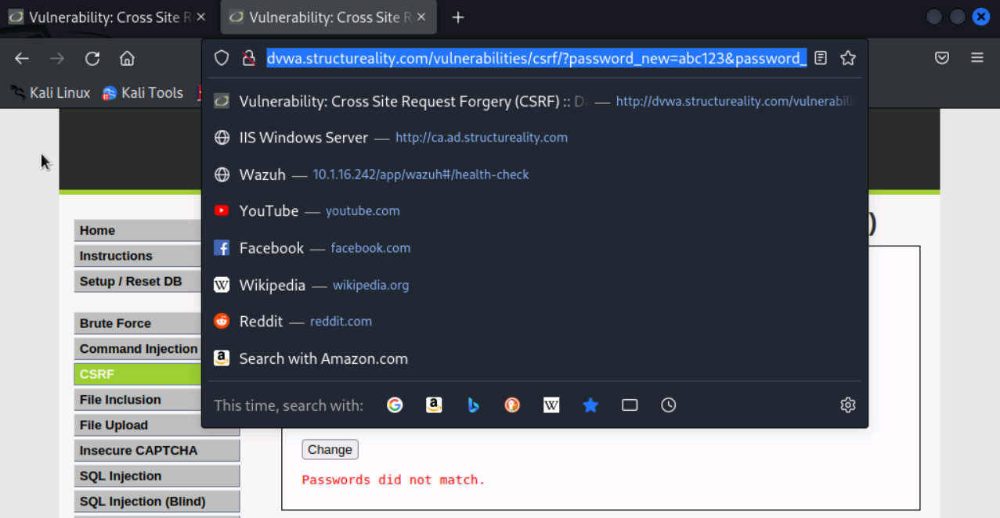
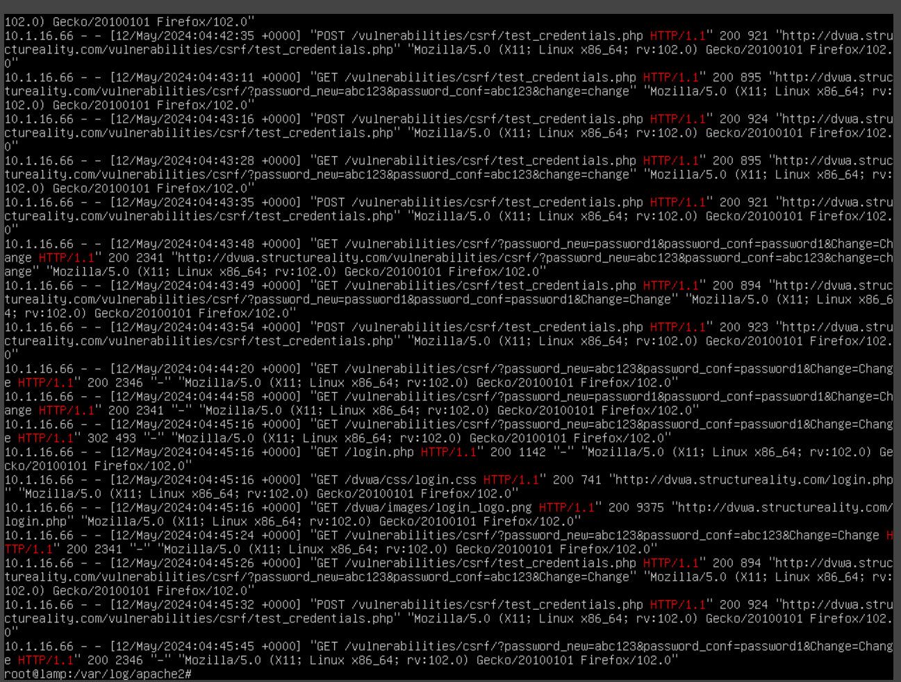

# CSRF-Simulation-DVWA

This project demonstrates a successful Cross-Site Request Forgery (CSRF) attack using **DVWA (Damn Vulnerable Web Application)**.  
The objective was to simulate credential modification by leveraging insecure request validation mechanisms in a real-world lab scenario.

---

## 📁 Project Structure

CSRF-Simulation-DVWA/<br/>
├── README.md<br/>
├── csrf1.png<br/>
├── http1.1grep.png<br/>

---

## 🛠️ Tools Used

- **DVWA (Damn Vulnerable Web Application)**
- **Kali Linux** (attacker box)
- **Burp Suite / curl** for request interception
- **Apache2** for hosting malicious payloads

---

## 🧪 Attack Walkthrough

1. **Target Application**:  
   - DVWA running on `dvwa.structreuality.com`

2. **CSRF Payload Constructed**:  
   - Malicious link targeting:
     ```
     http://dvwa.structreuality.com/vulnerabilities/csrf/?password_new=abc123&password_conf=abc123&Change=Change
     ```

3. **Execution**:  
   - Victim clicks the crafted URL while authenticated
   - Password change is executed **without interaction or prompt**

4. **Server-Side Evidence** (via Apache logs):
   - Confirmed multiple requests to `test_credentials.php`
   - Verified POST/GET traffic matching CSRF parameters
   - Logged IP: `10.1.16.66`

---

## 📸 Screenshots

### CSRF Payload Triggered in Browser  


### Apache Log Confirming CSRF Execution  


---

## 🔐 Mitigation Steps (Not Implemented in DVWA)

- Implement CSRF tokens per session
- Validate `Referer`/`Origin` headers
- Enforce `SameSite` cookie policy

---

## ⚠️ Disclaimer

This project is for educational use only. All testing was conducted in isolated, self-hosted lab environments.

---
